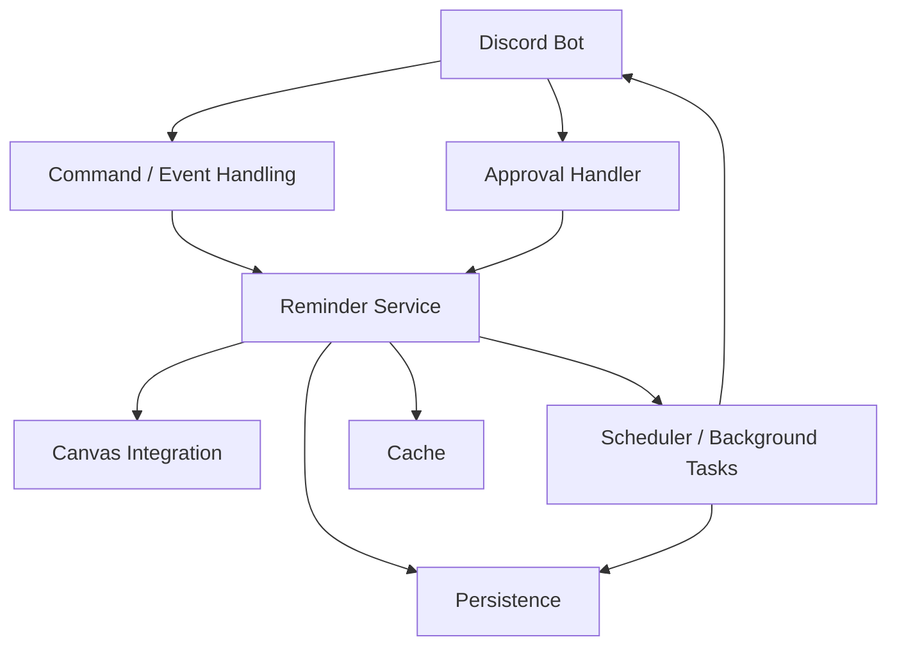

# Component Architecture

## Purpose

This document describes the internal components of the Discord Reminder Bot and the responsibilities of each component.

The system is organized into logical components so that Discord interaction, external API integration, reminder processing, scheduling, persistence, and caching remain separated.

## Component Overview



## Components

### Discord Bot

The Discord Bot is the primary interface between users, moderators, and the application.

Responsibilities:

* Receive Discord commands and events
* Send messages and reminders
* Handle user interactions
* Route requests to application components
* Coordinate moderator approval interactions

The Discord Bot should remain focused on Discord-specific behavior rather than containing the application's core reminder logic.

### Command and Event Handling

This component processes incoming Discord commands and events.

Responsibilities:

* Parse commands
* Validate command inputs
* Respond to user requests
* Forward application requests to the appropriate service
* Handle Discord events

Examples include creating, viewing, updating, or canceling reminders.

### Approval Handler

The Approval Handler manages moderator review of reminders or reminder-related content.

Responsibilities:

* Present reminder content for approval
* Process moderator approval interactions
* Process requested changes
* Update approval state
* Return revised content for another review when necessary

The approval workflow remains inside Discord so moderators do not need a separate communication channel.

### Reminder Service

The Reminder Service contains the main application logic for reminders.

Responsibilities:

* Process assignment information
* Create and update reminders
* Determine reminder times
* Apply time-zone handling
* Group reminders when multiple reminders can be delivered together
* Manage reminder state
* Coordinate with persistence and scheduling components

The Reminder Service should not depend on Discord-specific implementation details where possible.

### Canvas Integration

The Canvas Integration component communicates with the Canvas REST API.

Responsibilities:

* Retrieve courses and assignments
* Retrieve assignment deadlines
* Transform external API data into application data
* Handle Canvas API communication errors
* Provide Canvas data to the Reminder Service

Canvas remains an external system and is not controlled by the application.

### Scheduler / Background Tasks

The Scheduler is responsible for executing reminder-related work independently of direct user interaction.

Responsibilities:

* Register scheduled reminder jobs
* Detect reminders that are due
* Execute background tasks
* Trigger reminder delivery
* Support recurring or periodic background work where required

Scheduling should operate independently of Discord command handling so reminders can be processed without a user initiating an action.

### Persistence

The Persistence component stores application state that must survive beyond the lifetime of the running bot.

Potential data includes:

* Reminders
* Assignment information
* Approval state
* User preferences
* Reminder history
* Scheduling state

The specific database or storage technology is intentionally not defined at this architectural layer and will be determined separately.

### Cache

The Cache stores temporary or frequently accessed information to reduce repeated external requests and improve responsiveness.

Potential cached data includes:

* Recently retrieved Canvas data
* Frequently accessed course or assignment information
* Temporary application state

Cached data should not be treated as the authoritative source for state that must survive a bot restart.

## Component Interaction

### Reminder Creation

```text
Discord User
     │
     ▼
Command / Event Handling
     │
     ▼
Reminder Service
     │
     ├──────► Canvas Integration
     │
     ├──────► Persistence
     │
     └──────► Scheduler
```

### Approval

```text
Reminder Service
     │
     ▼
Approval Handler
     │
     ▼
Moderator
     │
 ┌───┴────┐
 ▼        ▼
Approve  Request Changes
 │        │
 ▼        ▼
Scheduler Reminder Service
```

### Reminder Delivery

```text
Scheduler
    │
    ▼
Reminder Service
    │
    ▼
Discord Bot
    │
    ▼
User
```

## State and Reliability

Application state that must survive a process restart should be stored through the Persistence component rather than kept exclusively in memory.

This allows the system to reconstruct pending work after a restart and reduces the risk of losing reminders or approval state.

The Cache is considered temporary and may be rebuilt when necessary.

## Design Principles

The component architecture follows these principles:

* Keep Discord-specific behavior separate from core reminder logic.
* Keep external API communication isolated in dedicated integrations.
* Keep scheduling and background execution separate from command handling.
* Persist state that must survive process restarts.
* Use caching only for temporary or performance-related data.
* Keep components focused on clear responsibilities.
* Avoid introducing additional architectural layers unless they solve a concrete requirement.

## Technology Mapping

Technology choices are intentionally kept separate from the component definitions.

The architecture defines **what each component does**, while the technology decisions define **how each component will be implemented**.

Technology decisions will be documented separately through the project's Architecture Decision Records.

## Related Documentation

* [System Overview](system-overview.md)
* [Architecture Decision Records](../decisions/)
