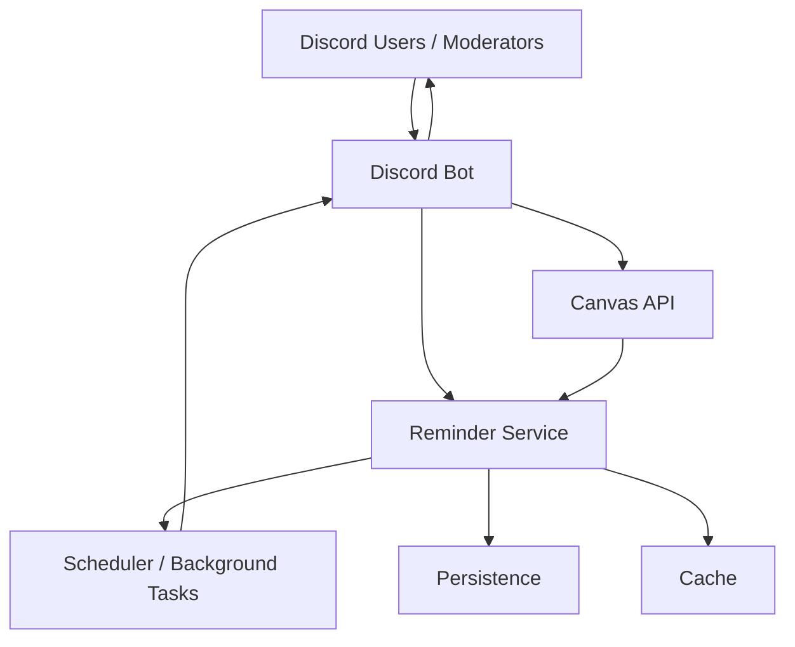
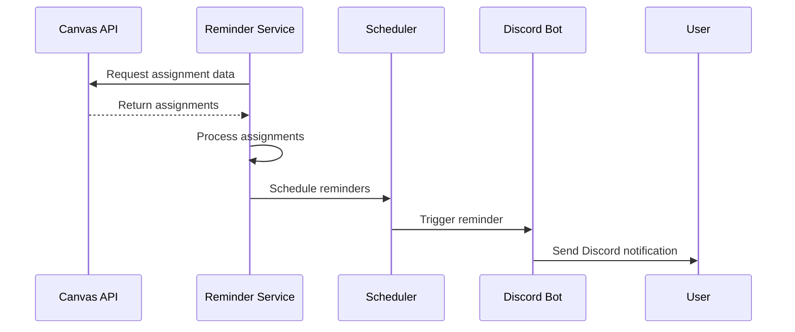
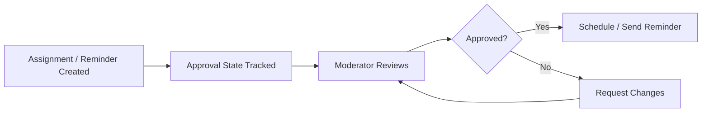

# System Overview

## Purpose

The Discord Reminder Bot is a Discord-based reminder system that retrieves assignment information from Canvas, processes upcoming deadlines, schedules reminders, and delivers them to users through Discord.

The system is designed to reduce manual tracking of assignments while allowing moderators to review and approve reminder content before it is delivered.

## System Architecture



## Major Components

### Discord Bot

The Discord bot provides the primary interface for users and moderators.

Responsibilities include:

* Receiving Discord commands and events
* Sending reminder messages
* Handling moderator approval
* Processing user interactions
* Routing requests to the appropriate application component

### Canvas Integration

The Canvas integration retrieves assignment and course information from the Canvas API.

Responsibilities include:

* Fetching assignments
* Retrieving assignment due dates
* Providing course and assignment information to the reminder service
* Handling communication with the external Canvas API

### Reminder Service

The reminder service contains the core application logic.

Responsibilities include:

* Processing assignments retrieved from Canvas
* Determining when reminders should be sent
* Handling time-zone conversions
* Grouping multiple reminders into a single message when appropriate
* Tracking reminder and approval state

### Scheduler / Background Tasks

The scheduler is responsible for running reminder-related tasks without requiring a user to manually trigger them.

Responsibilities include:

* Checking for upcoming reminders
* Triggering scheduled reminder jobs
* Running recurring background tasks
* Coordinating reminder delivery with the Discord bot

### Persistence

Persistent storage maintains application data that must survive beyond the lifetime of the running bot.

Potential data includes:

* User preferences
* Assignment information
* Reminder configuration
* Approval status
* Reminder history

The specific persistence technology is determined separately from the system architecture.

### Cache

The cache stores frequently accessed or temporary data to reduce unnecessary requests and improve application responsiveness.

Potential cached information includes:

* Recently retrieved Canvas assignments
* Temporary reminder state
* Frequently accessed user or course information

## Key Flows

### Assignment and Reminder Flow



### Approval Flow



### Time-Zone Handling

Assignment deadlines may originate from Canvas in a specific time zone while users may operate in different time zones.

The reminder service therefore handles time-zone conversion when determining and displaying reminder times.

```text
Canvas Assignment
       │
       ▼
Due Date + Source Time Zone
       │
       ▼
Reminder Service
       │
       ├──► User Time Zone A
       │
       └──► User Time Zone B
```

## Design Goals

The system architecture prioritizes:

* Clear separation between Discord interaction and application logic
* Reliable background reminder scheduling
* Integration with the Canvas API
* Explicit moderator approval
* Time-zone-aware reminders
* Reduced duplicate API requests through caching
* Persistence for state that must survive bot restarts
* Grouped notifications to avoid unnecessary Discord message spam

## Related Documentation

* Component Architecture
* Architecture Decision Records
* GitHub Actions and Repository Automation

